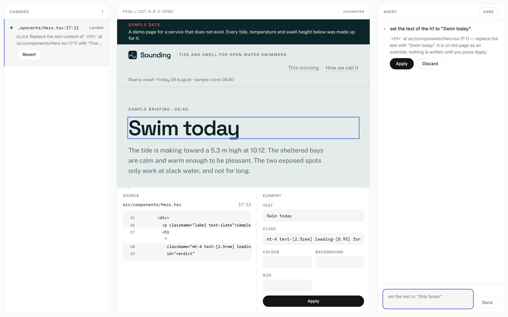
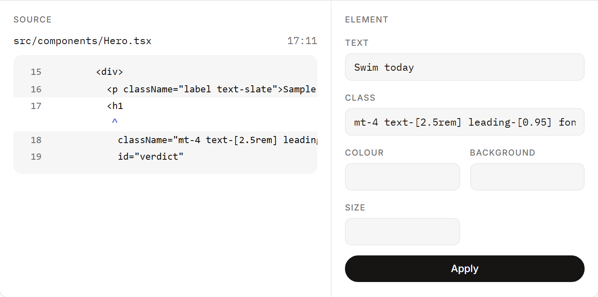
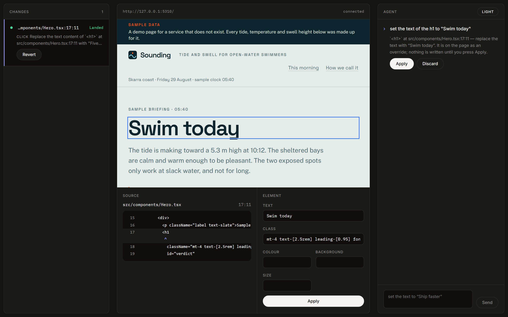

# Source-Mapped Visual Editor

A visual editor for React that **writes no source of its own**.

Open a project, click something, change it. That change is an illusion — a DOM override
painted over the page. The only thing that touches disk is a coding agent. When it finishes,
hot reload re-renders from the real file, the editor **lifts the override**, and compares
what React actually rendered against what you asked for.

Matching is the proof the edit landed. Not matching is a caught failure.



```bash
npm install
npm run dev -w @sve/studio     # → http://localhost:5300
```

Point it at a folder or a GitHub URL. **Your project is not modified to make this work** —
no config edit, no injected import, not a byte. The editor is merged into a dev server the
studio starts for you.

## Two ways in, one verdict

Click an element and edit it in the panel, **or** ask the agent in the chat. A chat message
does not reach the filesystem — it produces a *proposal*, which appears as an override you
can see, and Apply runs the same verified write a click would.

> `<h1>` at src/components/Hero.tsx:17:11 — replace the text with "Swim today".
> It is on the page as an override; nothing is written until you press Apply.

Every edit lands in the change log on the left with its verdict — **Landed**, **Drifted**,
**Blocked**, **Stalled** — and a per-row **Revert** that restores the file byte for byte.

## The inspector is a compiler diagnostic

A Babel pass stamps every JSX host element with the `file:line:col` it came from, so the
agent is *told* which element to edit rather than asked to find it. It gets `Read` and
`Edit` and nothing else — deliberately **no `Glob`, no `Grep`**. Searching is where agent
edits usually go wrong, so the step is removed entirely.



Two ids, because they answer different questions:

| | |
|---|---|
| `data-sve-loc` | `src/components/Hero.tsx:17:11` — exact, and **invalid the moment the agent writes**, because every line below the edit shifts |
| `data-sve-eid` | `…Hero.tsx#section:0/div:0/h1:0` — structural, survives that shift, and is how the element is found again after hot reload |

## Bring your own agent — including a free one

| | |
|---|---|
| **OpenAI-compatible** | one runner, three settings: base URL, key, model. DeepSeek, OpenRouter, Groq, Gemini's compatible endpoint, Ollama. |
| **Claude** | the Agent SDK, strongest at single-shot edits |
| **fake** | deterministic, in-process, no key — the default, and what CI runs |

A local endpoint (`localhost`, `127.0.0.1`, `host.docker.internal`) sends no `Authorization`
header at all, matched on the parsed hostname so `https://localhost.evil.example` is still
treated as remote.

**A cheap model is a real option here, not a compromise** — because a wrong edit is caught
and shown rather than silently landed. That is the whole reason the verifier is worth its
complexity.

## Dark and light



Warm neutrals, one accent, hairline rules, no animation. The preview keeps *your* app's
design — the chrome around it stays quiet.

## Testing

```bash
npm test          # unit
npm run e2e       # end-to-end, fake agent
npm run e2e:live  # opt-in, real agent, costs tokens
```

**The whole suite runs without an API key.** The fake agent can be told to write the *wrong*
thing on demand — which is the only reason the green path means anything.

Break the lift step so the DOM is read while the override is still painted, and v1's suite
reports:

```
✗ AC-5.2  a wrong write is caught      Expected: "drifted"  Received: "landed"
✓ AC-5.1  a text edit lands, and the file says so
```

**AC-5.1 passes with the verifier broken.** A verifier that always reports green sails
through the happy path; only the deliberately-wrong write tells the two apart.

### …and the same gate on the second way in

A second way to author an edit is the obvious place for a verification step to go missing.
So the same mutation runs against the studio, where one edit is **clicked** and the other is
**asked for in the chat**:

```
ok 2 [v2] AC-13.3 a clicked edit lands, and the file says so
ok 3 [v2] AC-13.4 a chat edit lands through the same loop, and writes nothing before Apply
x  4 [v2] AC-13.5 a clicked edit that is written wrong…   Expected: "drifted"  Received: "landed"
x  5 [v2] AC-13.5 a chat edit that is written wrong…      Expected: "drifted"  Received: "landed"

2 failed
7 passed
```

**Both authoring paths go red, and only they do.** Had breaking the verifier reddened only
the clicked test, the chat panel would be an unverified back door and the green suite would
have said nothing about it.

## Layout

```
packages/protocol/     zod wire contract shared by browser and node
packages/source-loc/   babel plugin + vite plugin — origin stamping
packages/overlay/      selection, override store, comparators, in-page panel
packages/rpc/          the typed postMessage wire to the preview frame
packages/bridge/       serial queue, byte-exact snapshots, path guard, agent runners
packages/vite-plugin/  joins the editor into any Vite dev server
packages/host/         opens a project and serves it, without editing it
packages/studio/       the three-panel workspace
apps/demo/             the React page under edit; also the E2E fixture
```

`docs/acceptance/*.md` holds the acceptance criteria, written before the code. When a test
fails the code changes — never the criterion.

## Scope

Text content, Tailwind class edits, and inline style props, on Vite + React projects.

Structural edits — adding, deleting, or moving elements — are **out**, and not by accident:
no stable element identity survives them, so re-anchoring after hot reload becomes
ambiguous, and an editor that cannot reliably find the element again cannot verify anything
it did to it.
