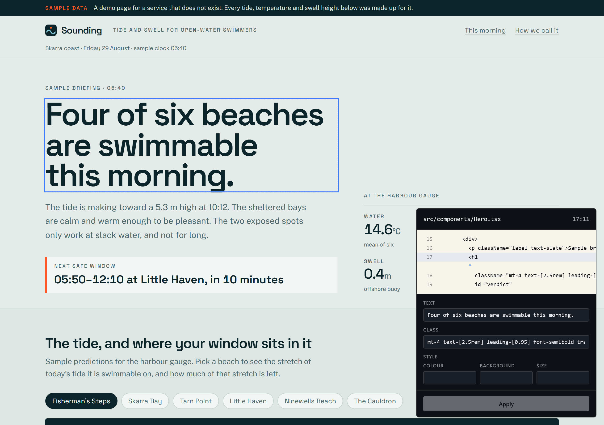
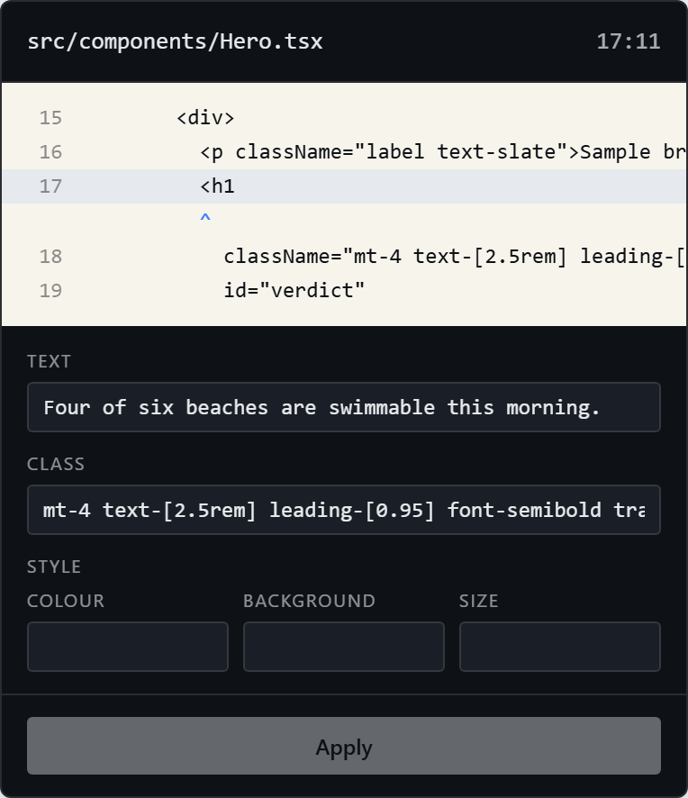
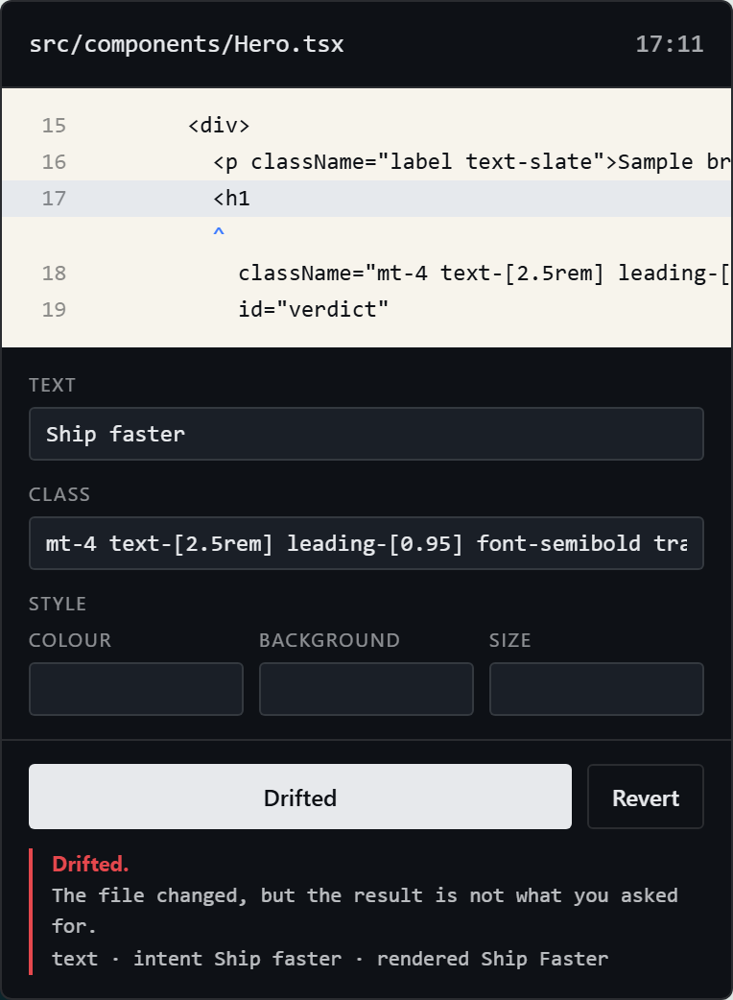

# Source-Mapped Visual Editor

A dev-time visual editor for React that **writes no source of its own**.

You click an element and change it. That change is an illusion — a DOM override painted
over the page. The only thing that touches disk is a headless coding agent. When it
finishes, hot reload re-renders from the real file, the editor **lifts the override**, and
compares what React actually rendered against what you asked for.

Matching is the proof the edit landed. Not matching is a caught failure.



## The inspector is a compiler diagnostic

Every JSX host element is stamped by a Babel pass with the `file:line:col` it came from, so
the agent is *told* which element to edit rather than asked to find it. The panel shows
that coordinate, the real source around it, and a caret under the exact column.



The agent gets `Read` and `Edit` and nothing else — deliberately **no `Glob`, no `Grep`**.
Searching is where agent edits usually go wrong, so the step is removed entirely.

## Hot reload is the test

The comparison is on *computed* values, not source text, so `bg-blue-500` and
`style={{ background: '#3b82f6' }}` both verify — the agent is free to express the change
however the surrounding code does.

When the agent writes something else, you are told, and the override stays so your intent
is not silently lost:



## Quick start

```bash
npm install
npm run dev          # demo + editor at :5173 — click anything
```

The page under edit imports nothing from the editor. `sve()` is build configuration; the
app never learns the editor exists.

```ts
// apps/demo/vite.config.ts
import { sve } from '@sve/vite';

export default defineConfig({
  plugins: [sve(), react(), tailwindcss()],
});
```

## Two ids, because they answer different questions

| | |
|---|---|
| `data-sve-loc` | `src/components/Hero.tsx:17:11` — exact, and **invalid the moment the agent writes**, because every line below the edit shifts |
| `data-sve-eid` | `…Hero.tsx#section:0/div:0/h1:0` — structural, survives that shift, and is how the overlay finds the element again after hot reload |

## Testing

```bash
npm test          # unit
npm run e2e       # end-to-end, SVE_AGENT=fake
npm run e2e:live  # opt-in, real agent, costs tokens
```

**The whole suite runs without an API key.** `SVE_AGENT=fake` is a deterministic in-process
editor, and it can be told to write the *wrong* thing on demand — which is the only reason
the green path means anything. Break the lift step so the DOM is read while the override is
still painted, and the suite reports:

```
✗ AC-5.2  a wrong write is caught      Expected: "drifted"  Received: "landed"
✓ AC-5.1  a text edit lands, and the file says so
```

**AC-5.1 passes with the verifier broken.** A verifier that always reports green sails
through the happy path; only the deliberately-wrong write tells the two apart.

### …and the same gate on the second way in

v2 added a chat panel, and a second way to author an edit is the obvious place for a
verification step to go missing. So the same mutation is run against the studio suite, where
one edit is **clicked** and the other is **asked for in the chat**. With step 3 of
`packages/studio/src/client/loop.ts` moved below step 4 — the DOM read while the override is
still painted — `npx playwright test --project v2` reports:

```
  ok 1 [v2] › AC-13.2 the fixture is connected, rendered, and stamped (88ms)
  ok 2 [v2] › AC-13.3 a clicked edit lands, and the file says so (1.4s)
  ok 3 [v2] › AC-13.4 a chat edit lands through the same loop, and writes nothing before Apply (1.3s)
  x  4 [v2] › AC-13.5 a clicked edit that is written wrong is caught, shown, and left in place (1.5m)
  x  5 [v2] › AC-13.5 a chat edit that is written wrong is caught the same way (1.5m)
  ok 6 [v2] › AC-13.6 a row reverts, byte for byte, and reads reverted (1.7s)
  ok 7 [v2] › AC-13.7 a project with no Vite config is refused in the host's own words (610ms)
  ok 8 [v2] › AC-13.7 a project where nothing was stamped is a blocking error, not a warning (827ms)
  ok 9 [v2] › AC-13.2 nothing under apps/demo was touched (69ms)

  1) AC-13.5 a clicked edit that is written wrong is caught, shown, and left in place
     Expected: "drifted"   Received: "landed"
  2) AC-13.5 a chat edit that is written wrong is caught the same way
     Expected: "drifted"   Received: "landed"

  2 failed
  7 passed (3.9m)
```

**Both authoring paths go red, and only they do.** That is the whole claim: a chat message
is not a shortcut to the filesystem, it is a way of producing an intent, and the intent is
verified by the loop the click path already ran. If breaking the verifier had reddened only
the clicked test, the chat panel would be an unverified back door and the green suite would
have said nothing about it.

## Layout

```
packages/protocol/     zod wire contract shared by browser and node
packages/source-loc/   babel plugin + vite plugin — origin stamping
packages/overlay/      selection, override store, inspector, comparators
packages/bridge/       serial queue, byte-exact snapshots, path guard, agent runners
packages/vite-plugin/  joins all four into one dev server
apps/demo/             the React page under edit; also the E2E fixture
```

`docs/acceptance/*.md` holds the acceptance criteria, written before the code and fixed
afterwards. When a test fails the code changes — never the criterion.

## Scope

Text content, Tailwind class edits, and inline style props.

Structural edits — adding, deleting, or moving elements — are **out**, and not by accident:
no stable element identity survives them, so re-anchoring after hot reload becomes
ambiguous, and an editor that cannot reliably find the element again cannot verify anything
it did to it.
